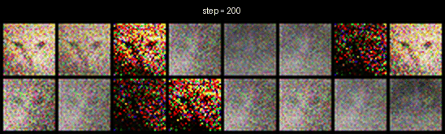
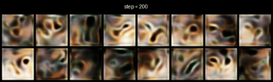
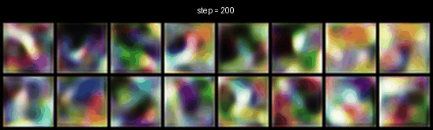
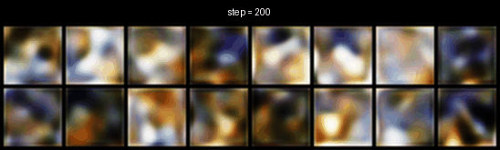
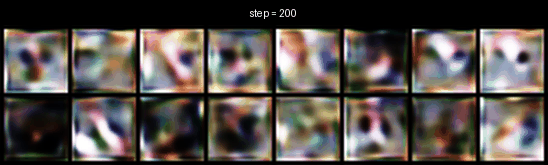
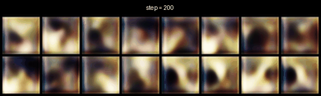

# GAN_cats_faces_32x32
Various experiments using cat's face dataset for GANs

1. Vanilla GAN
2. DCGAN
3. WGAN
4. WGAN-GP
5. LSGAN
6. DRAGAN

 

## 1. Vanilla GAN (Result)  

 

## 2. DCGAN (Result)  

 

## 3. WGAN (Result)  

 

## 4. WGAN-GP (Result)  

 

## 5. LSGAN (Result)  

 

## 6. DRAGAN (Result)  

 
